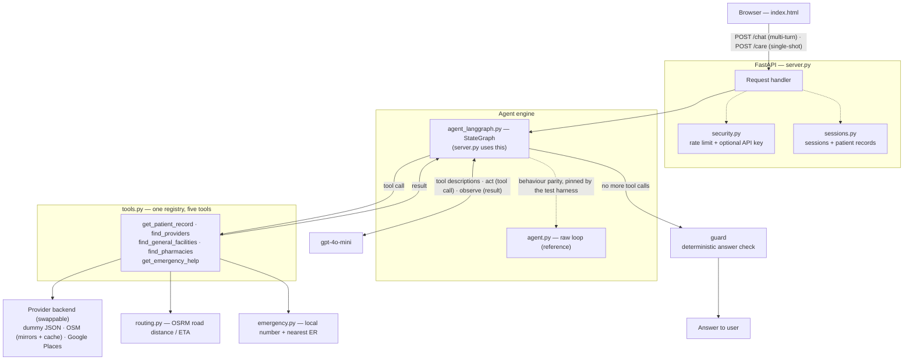
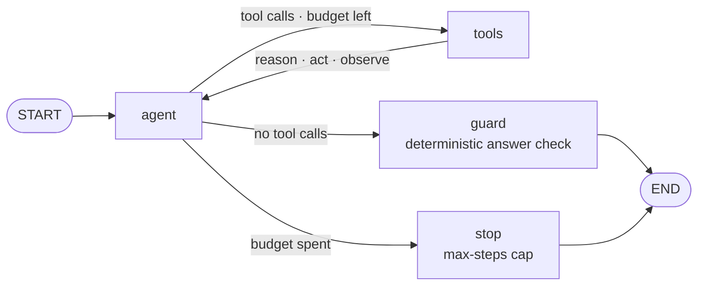
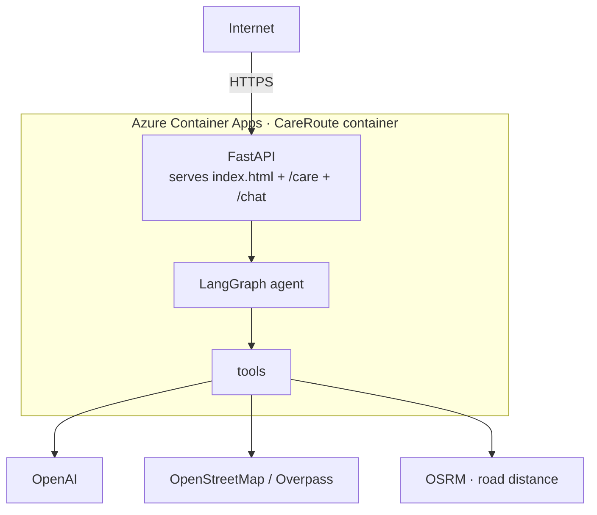

# CareRoute — Agentic Provider-Matching Assistant

A small **agentic AI** service: given a patient and their complaint, an LLM agent
reasons about the needed specialty, retrieves the patient's clinical record, and
finds the nearest matching healthcare providers by real driving distance. It
handles emergencies, pharmacy runs, and multi-turn follow-ups, and ships behind a
FastAPI web app with rate limiting, privacy-conscious logging, and a CI/CD
pipeline to Azure.

Built as a learning project to understand the agentic (tool-calling) pattern —
the same shape as a real care-coordination / referral system — it has since grown
into a small but complete service. Two interchangeable agent engines sit behind
one interface: a hand-rolled loop and a LangGraph port, with behavioural parity
proven by an offline test harness.

## What it demonstrates
- **Agentic loop** (reason -> act -> observe -> repeat) — implemented twice:
  raw OpenAI tool-calling (`agent.py`) and a LangGraph `StateGraph`
  (`agent_langgraph.py`), same behaviour, one import swap apart
- **Tool calling / function calling** — the LLM chooses tools; our code executes
  them. Five tools: patient-record retrieval, specialist search, general-facility
  fallback, pharmacy lookup, and emergency triage
- **Condition -> specialty reasoning** done by the model, not hardcoded, steered
  toward the *least-specific* fitting specialty (sparse OSM tags punish
  over-specific choices)
- **Emergency triage first** — a suspected emergency short-circuits the specialty
  search: the agent returns the local emergency number and nearest ER, and that
  answer bypasses the specialist guard
- **Multi-turn conversations** — a LangGraph checkpointer keeps each conversation's
  thread and patient record alive across HTTP requests, so later turns refine the
  routing (adding meds, or raising a new need like "now I need painkillers")
- **Model-driven recovery** — a specialty miss comes back as a structured result
  (`match_found: false` + a hint), and the agent retries with a larger radius or a
  re-mapped specialty, or offers labelled non-specialist alternatives, before
  falling back honestly
- **Deterministic output guard** — a code-level check withholds any provider list
  that no tool confirmed, and refuses to let an upstream outage be reported as
  "no specialists found"
- **Real road distance + ETA via OSRM** — driving distance and duration that match
  what a user sees in Maps, with haversine kept as a cheap no-network pre-filter
  and graceful fallback (never fails the lookup)
- **Outage resilience** — three independently operated OpenStreetMap mirrors, a
  7-day on-disk fetch cache (~1 km location cells), and stale-if-error serving, so
  a dead upstream degrades the demo instead of blanking it
- **Offline regression harness** — golden-transcript tests drive the graph with a
  scripted model: no API key, no network, deterministic
- **Real patient records** — 108 Synthea-derived patients, loaded from local disk
  in dev or Azure Blob in production by the same code path
- **Production concerns** — per-IP rate limiting, optional API-key gate, a daily
  circuit breaker, privacy-conscious structured logging, and a
  test -> build -> deploy -> smoke-test CI/CD pipeline
- **Guardrails**: a max-steps cap, per-tool error handling, and tool-side clamping
  of model-supplied arguments (search radius)

## Architecture



On a specialty miss the OSM backend's `find_providers` returns
`{"match_found": false, "hint": ..., "general_alternatives": [...]}` instead of a
silent nearest-anything list — the model reads the hint and either loops back with
a larger `radius_m` (or a different specialty), or offers the labelled
non-specialist alternatives, before answering.

## The agent engines

`agent_langgraph.py` is a behaviour-parity port of the hand-rolled loop in
`agent.py`. The loop was already a graph; LangGraph just makes the shape explicit:



State carries the conversation plus everything the old loop kept in local
variables: `confirmed_providers` (names a successful `find_providers` returned),
`offered_facilities` (anything unverified), `tool_errors` (tools that FAILED — not
the same fact as tools that found nothing), `is_emergency` (an emergency answer
skips the specialist guard), and `llm_calls` (the step budget, counted in model
calls so the cap keeps its meaning).

The guard is the last line of defence, in code, because prompt instructions alone
did not hold: a recommendation list with no confirmed specialist gets withheld,
and an answer produced after a directory outage gets prefixed with an explicit
"this is NOT a confirmed result" warning. Emergency answers are exempt — they are
a call-for-help plus hospitals, not a specialist claim.

Parity is pinned by `test_agent_langgraph.py`: a scripted stand-in model replays
fixed tool-call sequences ("golden transcripts"), so the tests verify the graph's
behaviour — tracking, guard, step cap, outage handling, tool schemas — with no API
key and no network. `agent.py` is kept on purpose as the reference implementation:
the pair plus the harness documents the migration rather than hiding it.

## Multi-turn conversations

The web app talks to `/chat`, the multi-turn sibling of `/care`. The first turn
omits `session_id` and starts a conversation; the response returns one, which the
client sends back on every follow-up. Under the hood:

- The same graph is compiled with a **`MemorySaver` checkpointer**; the
  `session_id` *is* the LangGraph `thread_id`, so a later turn sees the whole
  transcript and the model has real context.
- A stable `patient_id` keeps the patient record alive in memory for the length of
  the session, so location and the accumulating medication/history list survive
  across turns instead of being rebuilt each request.
- **Per-turn vs per-conversation state**: `llm_calls`, `tool_errors`, and
  `is_emergency` reset each turn (they describe *this* message); `confirmed_providers`
  and `offered_facilities` persist, so re-mentioning an earlier tool-confirmed
  provider is not treated as a hallucination by the guard.
- `sessions.py` sweeps idle sessions (30-minute TTL, hard cap of 5000) and frees
  their patient records.

**Scaling caveat** (the interview point): the checkpointer, sessions, and rate-limit
buckets all live in process memory, so they are per-replica and lost on restart.
Swap `MemorySaver` for a DB-backed saver (Sqlite/Postgres) and move sessions and
rate limits to Redis to run more than one replica.

## Emergency triage

`get_emergency_help` (in `emergency.py`) is called first when the complaint looks
like an emergency — seizure, stroke signs, major trauma, heavy bleeding, chest pain
with cardiac features, fainting, or trouble breathing. It returns:

- **The local emergency number to dial now** — resolved from a cached Nominatim
  reverse-geocode, with a coarse offline bounding-box fallback and `112` (a
  GSM-standard number) as the final default. The number never depends on a network
  call succeeding.
- **The nearest hospitals** (which all have emergency departments), best-effort via
  the OSM fetch — layered on top, and omitted silently if Overpass is down.

The agent leads its answer with the number, and the emergency answer bypasses the
specialist guard.

## Distance and ETA

Ranking used to be straight-line (haversine) distance, which looked wrong next to
Maps (a clinic 170 m away showed as 3.78 km). `routing.py` now upgrades results to
**real road distance and driving time via OSRM**:

- Haversine stays upstream as a cheap, no-network pre-filter to shortlist the
  nearest ~8 candidates — OSRM is never asked about far-away places.
- OSRM is called **once per query** via its Table service (one source -> many
  destinations), so a shortlist of 8 costs one HTTP request.
- **Graceful fallback**: if OSRM is unreachable, results keep the haversine distance
  and are labelled `distance_type: straight_line` rather than failing. Correctness
  of "is there a provider" never depends on OSRM — only the accuracy of the number.

Point `OSRM_BASE_URL` at a self-hosted OSRM or a paid routing provider for real
load; the public demo server has no SLA and is rate-limited.

## Patient data

`data/patients.json` holds **108 patients derived from Synthea** (synthetic FHIR
data), remapped to Bengaluru neighbourhoods so they fall within range of the demo
providers. Each record has demographics, coarse location, clinical history,
current medications, and allergies.

- `synthea_to_patients.py` is the converter (drops Synthea's non-clinical
  "conditions", keeps active meds, remaps Massachusetts coordinates to Bengaluru
  deterministically). Run it only to regenerate the data.
- `data_source.py` follows the 12-factor idea: **local `./data/*.json` in dev,
  Azure Blob in production**, chosen purely by env vars (`BLOB_ACCOUNT_URL`). The
  code never changes between laptop and prod; only configuration does. Nothing
  holds a password — Azure uses the Container App's managed identity, and locally
  `DefaultAzureCredential` falls back to your `az login` session.

## Setup (all backends)

Python 3.11 (the version used by the Docker image and CI; 3.10+ should work).

```bash
pip install -r requirements.txt
cp .env.example .env      # then fill in the values you need
```

Versions are pinned: the LangChain ecosystem moves fast (the prebuilt
`create_react_agent` was deprecated in favour of `create_agent` within months), so
unpinned installs rot.

`.env.example` documents every variable. The minimum to run the agent:

```
OPENAI_API_KEY=sk-...
# optional — pick a provider backend (see below):
# USE_REAL_PROVIDERS=osm
```

> **`.env` gotcha:** keep comments on their own lines. `python-dotenv` reads
> `KEY=            # note` as the literal value `# note`, not as empty — which once
> silently turned API-key auth on and caused 401s.

## Choosing a provider backend

`find_providers` (and its `find_general_facilities` / `find_pharmacies` siblings)
has three interchangeable implementations behind one signature. `USE_REAL_PROVIDERS`
selects one **once, at import time** — set it before starting, and restart the
server after changing it. On startup the terminal prints which one is live:

```
[tools] find_providers backend: openstreetmap
```

| Backend | `USE_REAL_PROVIDERS` | Data | Needs |
|---|---|---|---|
| Dummy JSON | *(unset)* | 10 mock Bengaluru providers | nothing (offline) |
| OpenStreetMap | `osm` | real facilities via Overpass API | internet for the first fetch per area; cached for 7 days after |
| Google Places | `google` | real providers via Places API | `GOOGLE_MAPS_API_KEY` + billing |

Only the OSM and Google backends do real road distance (OSRM), pharmacy lookup, and
the labelled general-alternatives fallback; the dummy backend is a simpler offline
stand-in for tests and quick demos.

### 1) Dummy backend (default — works offline)

```bash
# CLI demo (current engine)
python agent_langgraph.py

# CLI demo (reference implementation)
python agent.py

# Web demo -> open http://localhost:8000
uvicorn server:app --reload
```

### 2) OpenStreetMap backend (real facilities, free, no key)

PowerShell (Windows):
```powershell
$env:USE_REAL_PROVIDERS="osm"; uvicorn server:app --reload
```

bash / zsh (macOS, Linux):
```bash
USE_REAL_PROVIDERS=osm uvicorn server:app --reload
```

Or simply add `USE_REAL_PROVIDERS=osm` to `.env` and run
`uvicorn server:app --reload` — `tools.py` loads `.env` before reading the flag.

The OSM backend rotates across three independently operated public Overpass
instances (FOSSGIS, VK Maps, Private.coffee) and caches every successful fetch to
`data/osm_cache.json` (gitignored). Running `python osm.py` once while a mirror is
up pre-warms the cache for the demo area, which makes the web demo outage-proof for
that area for a week.

### 3) Google Places backend (real providers, key + billing required)

Add to `.env`:
```
USE_REAL_PROVIDERS=google
GOOGLE_MAPS_API_KEY=AIza...
```
then:
```bash
uvicorn server:app --reload
```

PowerShell one-liner without `.env`:
```powershell
$env:USE_REAL_PROVIDERS="google"; $env:GOOGLE_MAPS_API_KEY="AIza..."; uvicorn server:app --reload
```

## Security and rate limiting

`/care` and `/chat` run the agent (several LLM calls plus real map lookups), so the
real exposure is **volume**. `security.py` puts three independent, env-toggled
layers in front of them (all framework-agnostic and unit-testable — run
`python security.py`):

| Layer | Env var | Default |
|---|---|---|
| Per-IP token-bucket rate limit | `CAREROUTE_RATE_PER_MIN`, `CAREROUTE_BURST` | 20/min, burst 5 (on) |
| Optional API-key gate (`X-API-Key`, constant-time compare) | `CAREROUTE_API_KEYS` | empty = open |
| Optional daily circuit breaker (global cap on `/care` calls) | `CAREROUTE_DAILY_CALL_CAP` | 0 = off |

Behind Azure Container Apps ingress the real client IP arrives in
`X-Forwarded-For`, trusted by default (`CAREROUTE_TRUST_XFF=1`). CORS is locked with
`CAREROUTE_ALLOWED_ORIGINS` (defaults to `*` for local dev). The hard budget stop is
still the monthly spend limit set in the OpenAI and Google Cloud billing consoles.

## Logging and privacy

`request_log.py` emits one JSON line per interaction to stdout (and, if
`CAREROUTE_LOG_FILE` is set, to a file too), so on Azure the platform ships it to
Log Analytics with no extra infrastructure — query it with KQL.

This app handles symptoms, medications, and location, so logging is
privacy-conscious **by default**: it records the text and answer needed to analyse
usage, coarsens coordinates to ~1.1 km (2 dp), and **omits direct identifiers**
(name, exact coordinates). Set `CAREROUTE_LOG_PII=1` to also log name and exact
coordinates — and then treat the log store as sensitive.

## Tests (no LLM key needed except where noted)

Run these with `USE_REAL_PROVIDERS` unset unless noted:

```bash
python test_agent_langgraph.py   # offline harness for the LangGraph engine:
                                 # scripted model, real dummy tools; verifies
                                 # guard, tracking, step cap, outage handling,
                                 # and tool-schema fidelity (6 tests)
python tools.py                  # deterministic tools: record lookup, haversine
                                 # ranking, and BOTH structured-miss paths
python security.py               # rate limiter + daily-cap self-test (pure stdlib)
python sessions.py               # session create / sweep / cap self-test
python request_log.py            # logging self-test (asserts PII omitted, coords coarsened)
python osm.py                    # live Overpass + OSRM near Koramangala (needs
                                 # internet; also pre-warms the fetch cache)
python mocktest.py               # exercises the OLD loop with a scripted model
```

`python test_agent_langgraph.py` is the gate the CI pipeline runs before any build.

## Deployment

CareRoute runs as a single Docker container on **Azure Container Apps**. The
container serves the FastAPI app (`server:app`) with uvicorn on port 8000, and Azure
fronts it with public HTTPS ingress.

### Architecture



Supporting resources:

| Resource | Purpose |
|---|---|
| Resource group | Groups everything below |
| Container registry (ACR, Basic) | Stores the container image |
| Container Apps environment | Hosts the app |
| Container App (0.5 CPU, 1 GiB) | The running service |
| Log Analytics workspace | Application and container logs |

Secrets and config on the Container App:

- **Secret** `OPENAI_API_KEY` — referenced by the container, never baked into the image
- **Env var** `USE_REAL_PROVIDERS=osm` — switches provider lookup from the dummy backend to live OpenStreetMap
- **Env var** `GIT_SHA` — set by CI to the deployed commit, surfaced at `/version`

### Prerequisites

- Docker
- Azure CLI, logged in (`az login`)
- An OpenAI API key

### Set your own values

The manual commands below use these variables. Fill them in with your own names.

```bash
RG="<resource-group>"     # a group you create for this app
LOCATION="<region>"       # e.g. southindia, eastus
ACR="<registry-name>"     # globally unique, letters and numbers only
ENVIRONMENT="<env-name>"  # Container Apps environment
APP="<app-name>"          # your Container App
IMAGE="careroute"         # image repo name inside the registry
```

### 1. Build and test locally

```bash
docker build -t careroute:local .
docker run --rm -p 8000:8000 --env-file .env careroute:local
# open http://localhost:8000
```

### 2. Create the resource group and registry

```bash
az group create --name "$RG" --location "$LOCATION"

az acr create --resource-group "$RG" --name "$ACR" --sku Basic
```

### 3. Build the image in ACR

```bash
az acr build --registry "$ACR" --image "$IMAGE:v1" .
```

### 4. Create the Container Apps environment

```bash
az containerapp env create \
  --name "$ENVIRONMENT" \
  --resource-group "$RG" \
  --location "$LOCATION"
```

### 5. Create the Container App

```bash
az containerapp create \
  --name "$APP" \
  --resource-group "$RG" \
  --environment "$ENVIRONMENT" \
  --image "$ACR.azurecr.io/$IMAGE:v1" \
  --registry-server "$ACR.azurecr.io" \
  --target-port 8000 \
  --ingress external \
  --cpu 0.5 --memory 1.0Gi \
  --secrets openai-api-key=<YOUR_OPENAI_KEY> \
  --env-vars OPENAI_API_KEY=secretref:openai-api-key USE_REAL_PROVIDERS=osm
```

> Pass `<YOUR_OPENAI_KEY>` at the command line — never commit the real key.
> Azure also needs pull access to the registry; the portal wires this up
> automatically, and via CLI you enable it with the ACR admin user or a managed identity.

### 6. Verify

```bash
curl https://<your-app-url>/version
# expect: {"version": "...", "commit": "<sha>", "backend": "openstreetmap"}
```

If `backend` comes back as `dummy-json`, the `USE_REAL_PROVIDERS=osm` env var is
missing from the active revision — set it and roll a new revision.

### Watching logs

```bash
az containerapp logs show --name "$APP" --resource-group "$RG" --follow
```

A healthy run shows `find_providers backend: openstreetmap`, the model calling
`get_patient_record(...)` and `find_providers(...)`, any structured-output retry
paths, and HTTP 200 responses.

## CI/CD

`.github/workflows/deploy.yml` runs on every push to `main` (and on demand). It is a
single job that gates on tests before it deploys, and verifies the live app after:

1. **Test gate** — set up Python 3.11, install deps, run `python test_agent_langgraph.py`.
   A failing test stops the pipeline before any build.
2. **Build** — log in to Azure via OIDC (no stored secrets), then `az acr build` the
   image tagged with both the commit SHA and `latest`.
3. **Deploy** — `az containerapp update` to the new image, passing `GIT_SHA` so the
   running app can report exactly which commit is live.
4. **Smoke test** — poll `/version` until it reports the SHA just deployed (guards
   against a stale image / unrolled revision), then `POST /care` and confirm an
   answer comes back, with generous timeouts and retries for cold starts.

Configure the workflow's Azure resource names at the top (`RESOURCE_GROUP`,
`ACR_NAME`, `CONTAINER_APP`) and provide `AZURE_CLIENT_ID`, `AZURE_TENANT_ID`, and
`AZURE_SUBSCRIPTION_ID` as repository secrets.

## Note on the fallback path

When no specialist matches, the design keeps non-specialist options **structurally
labelled** rather than merely asking the model to behave:

- The **dummy backend** returns `match_found: false` with a count and the available
  specialties — no facility names in the miss payload at all.
- The **OSM backend** goes further and surfaces `general_alternatives`: the nearest
  general facilities (with road distance/ETA), each carrying
  `is_specialist_match: false`, because users want nearby options immediately. The
  answer guard harvests those names into `offered` (unverified), so a bare list can
  never be presented as confirmed specialists.
- Cosmetic/single-specialty boutiques (skin, hair, laser, dental, eye, fertility…)
  are filtered out of *general* lists — never from specialist results, and never
  pharmacies — because a hair clinic is noise for an unrelated complaint.

This is on purpose. An earlier version put general facilities directly in the miss
payload and told the model in the system prompt not to present them as specialists.
It did anyway — a dental clinic was recommended for anxiety attacks, with an
invented justification. The lesson, repeated across the codebase: **a prompt
instruction is advisory; a data structure — and a code guard — is enforced.**

## Note on outages

During a real Overpass outage (August 2026), `find_providers` returned an error;
the model treated the error as a miss, escalated the search radius three times
(making the timeouts *more* likely), and told a cardiac patient that no cardiologist
was found — while Sri Jayadeva Institute of Cardiology sat 3.3 km away. A failed
lookup is not an empty lookup, and only the second justifies that sentence.

The fix lives at two layers. **Data layer**: rotate across genuinely independent
mirrors (two of the original three turned out to be the same operator under two
names), cache successful fetches, serve stale data during a total outage, and — if
truly nothing is available — return a **typed** error
(`error_type: upstream_unavailable`) whose hint explicitly forbids the false framing
and says to retry the same radius rather than escalate. **Orchestration layer**: the
graph records `tool_errors` in state, and the guard prefixes any post-outage answer
with "this is NOT a confirmed result".

## What I'd do next (talking points)

- **Durable, multi-replica state**: swap the in-memory `MemorySaver`, sessions, and
  rate-limit buckets for DB-backed (Sqlite/Postgres) and Redis stores so the app can
  scale past one replica and survive restarts
- **Cut LLM calls further**: a semantic symptom -> specialty cache (the provider-fetch
  side is already cached deterministically in `osm.py`)
- Real provider DB with a **geospatial index** (e.g. PostGIS) instead of a
  per-request scan
- Real clinical records over **FHIR / HL7** APIs instead of remapped Synthea JSON
- **Eval + observability** (LangSmith/Langfuse) to trace each tool call and log token
  usage per step
- Verify emergency numbers against an authoritative per-country source; return copies
  / immutable reads under concurrency; tighten PHI access controls